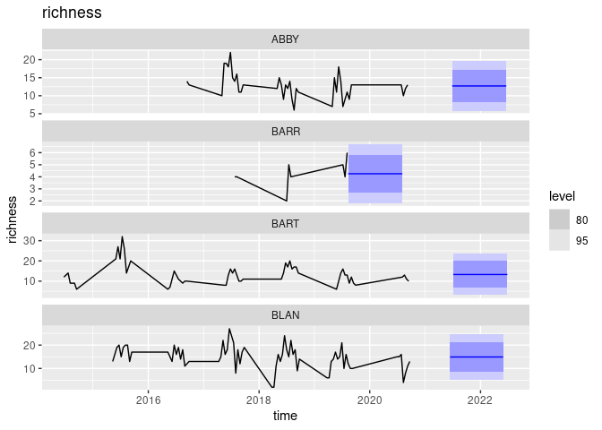
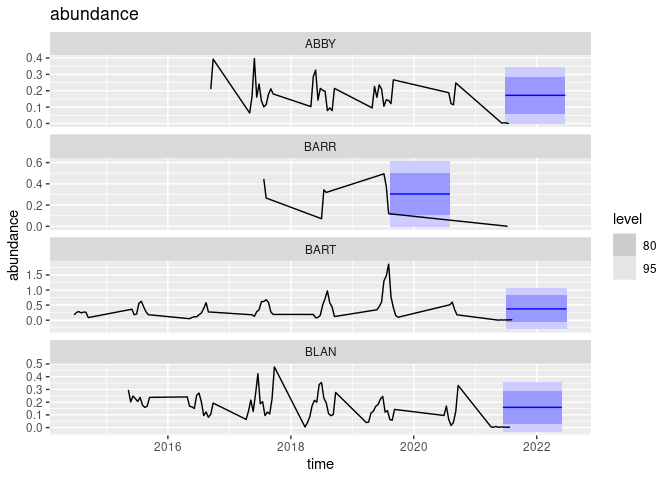

``` r
knitr::opts_chunk$set(message=FALSE)
```

``` r
library(neonstore)
library(neon4cast) # remotes::install_github("eco4cast/neon4cast", dep=TRUE)
library(tidyverse)
library(tsibble)
library(fable)
```

# A trivial forecast

``` r
## uuid::UUIDgenerate()
iteration_id <- uuid::UUIDgenerate()  #"c2cb06c2-4bf3-4aa0-9690-1fdd098a7ac5"

#forecast_date <- Sys.Date()
forecast_date <- as.Date("2021-07-01")
```

## Access Target Data

``` r
targets <-
  "https://data.ecoforecast.org/targets/beetles/beetles-targets.csv.gz" %>% 
  read_csv(col_types = "cDdd") %>% 
  as_tsibble(index = time, key = siteID)
```

``` r
past <-  targets %>% filter(time < forecast_date)
```

## Compute a forecast

``` r
## Compute a simple mean/sd model per site... obviously silly given huge seasonal aspect
null_richness <- past  %>% 
  model(null = MEAN(richness)) %>%
  forecast(h = "1 year")

null_abundance <- past  %>%
  model(null = MEAN(abundance)) %>%
  forecast(h = "1 year")
```

## Adjust prediction to ISOweek

## Visualize the forecast

``` r
first4 <- unique(null_richness$siteID)[1:4]

null_richness %>% filter(siteID %in% first4)  %>% autoplot(past) + ggtitle("richness")
```

    ## Warning: Removed 11 row(s) containing missing values (geom_path).

<!-- -->

``` r
null_abundance %>% filter(siteID %in% first4)  %>% autoplot(targets) + ggtitle("abundance")
```

<!-- -->

## EFI Formatting

EFI requires a flat-file format for forecasts that avoids the use of
complex list columns.  
To convey uncertainty, forecasts must be expressed either by giving mean
and standard deviation (for predictions that are normally distributed)
or must express forecasts as an ensemble of replicate draws from
forecast distribution. The helper function `efi_format()` handles this
transformation.

``` r
## Combine richness and abundance forecasts. drop the 'model' column
forecast <- inner_join(efi_format(null_richness), 
                            efi_format(null_abundance)) %>%
  select(!.model) # we can have only one model per file in EFI format
```

Dates must be expressed as the Monday of the week the sampling would be
performed.  
This way don’t need to predict the precise day that the trap is
collected, all traps collected in the same week will count as an
observation made for that week.

``` r
iso_week <- function(x){
  monday <- gsub("\\d$", "1", ISOweek::date2ISOweek(x) )
  ISOweek::ISOweek2date(monday)
  }
```

``` r
forecast <- forecast %>% mutate(time = iso_week(time) )
```

``` r
forecast_file <- glue::glue("{theme}-{date}-{team}.csv.gz",
                            theme = "beetles", 
                            date=forecast_date,
                            team = "cb_f1")
write_csv(forecast, forecast_file)
```

``` r
neon4cast::forecast_output_validator(forecast_file)
```

    ## [1] TRUE

``` r
yaml_meta <- neon4cast::create_model_metadata(forecast_file)
eml_file <- neon4cast::write_metadata_eml(forecast_file, 
                                          yaml_meta, 
                                          forecast_issue_time = forecast_date, 
                                          forecast_iteration_id = iteration_id)
```

    ## Warning in readChar(path, nchar): truncating string with embedded nuls

``` r
submit(forecast_file, metadata = eml_file)
```

    ## [1] TRUE
