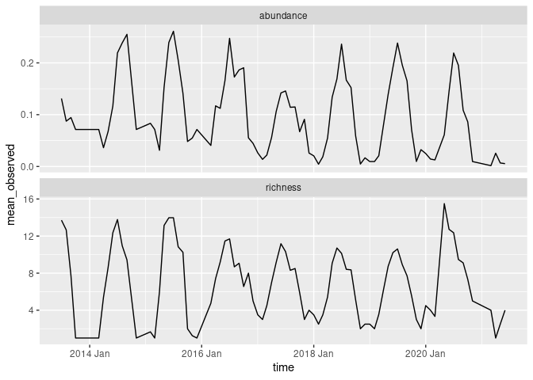
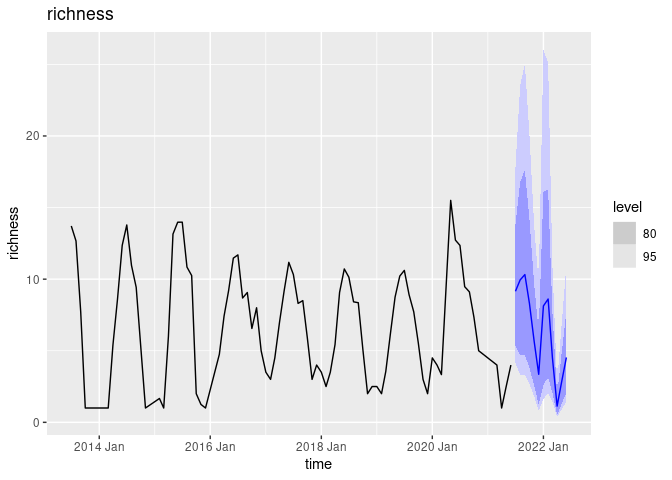
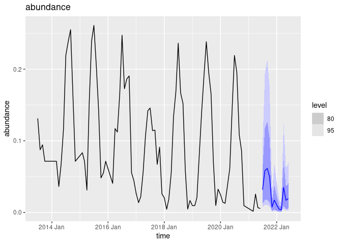

``` r
knitr::opts_chunk$set(message=FALSE)
```

``` r
library(neonstore)
library(tidyverse)
library(tsibble)
library(fable)
library(neon4cast) # remotes::install_github("eco4cast/neon4cast", dep=TRUE)

source("R/iso_week.R")
```

# A trivial ARIMA forecast

``` r
team <- "cb_f3"

forecast_date <- Sys.Date() 
forecast_date <- as.Date("2021-07-01") # back-dated, but properly blind

iteration_id <- uuid::UUIDgenerate() # "fdacebd2-4214-43c9-8986-4497f8b1fbeb"
```

## Access Target Data

``` r
targets <-
  "https://data.ecoforecast.org/targets/beetles/beetles-targets.csv.gz" %>% 
  read_csv(col_types = "cDdd") %>% 
  as_tsibble(index = time, key = siteID)
```

``` r
past <-  targets %>% filter(time < forecast_date)
```

## Compute a forecast

``` r
national_ave <- past %>%
  index_by(Time = ~ yearmonth(.)) %>% # temporal aggregates
  summarise(
    richness = mean(richness, na.rm = TRUE),
    abundance = mean(abundance, na.rm = TRUE)
  ) %>% rename(time = Time)


national_ave %>% 
  pivot_longer(c("richness", "abundance"), 
               names_to = "variable", 
               values_to="mean_observed") %>% 
  ggplot(aes(time, mean_observed)) + geom_line() +
  facet_wrap(~variable, ncol = 1, scales = "free_y")
```

<!-- -->

While a hierarchical forecast could allow us to pool power across sites,
a simple starting point might be to try and back out the site-level
predictions based on a forecast of this strong seasonal pattern.  
An ARIMA model is a good way to capture this periodic trend. We will use
log-transforms as a simple way to avoid the possibility of negative
values in our predictions.

``` r
ave_richness <- national_ave %>%
  fill_gaps() %>%
  model(arima = ARIMA(log(richness))) %>%
  forecast(h = "1 year")

ave_richness %>% autoplot(national_ave) + ggtitle("richness")
```

<!-- -->

``` r
ave_abund <- national_ave %>%
  fill_gaps() %>%
  model(arima = ARIMA(log(abundance))) %>%
  forecast(h = "1 year")

ave_abund %>% autoplot(national_ave) + ggtitle("abundance")
```

<!-- -->

We treat the sites as merely random draws from this national pool,
weighted by the fraction that each site has contributed to the grand
total observed richness.

``` r
site_weights <- 
  past %>% as_tibble() %>% 
  group_by(siteID) %>% 
  summarise(richness_share = sum(richness, na.rm=TRUE),
            abundance_share = sum(abundance, na.rm=TRUE)) %>% 
  mutate(richness_share = richness_share / sum(richness_share),
         abundance_share = abundance_share / sum(abundance_share))
site_weights
```

    ## # A tibble: 47 × 3
    ##    siteID richness_share abundance_share
    ##    <chr>           <dbl>           <dbl>
    ##  1 ABBY          0.0224          0.0183 
    ##  2 BARR          0.00157         0.00647
    ##  3 BART          0.0362          0.0628 
    ##  4 BLAN          0.0476          0.0313 
    ##  5 BONA          0.00250         0.00170
    ##  6 CLBJ          0.0121          0.00391
    ##  7 CPER          0.0463          0.0650 
    ##  8 DCFS          0.0226          0.0105 
    ##  9 DEJU          0.00671         0.00194
    ## 10 DELA          0.0194          0.00995
    ## # … with 37 more rows

``` r
# Note distribution is normal in log-transformed variable
national_model <- ave_richness %>% 
    dplyr::mutate(sd = sqrt( distributional::variance( richness ) ) ) %>%
    dplyr::rename(mean = .mean) %>%
    dplyr::select(time, .model, mean, sd) %>%
    tidyr::pivot_longer(c(mean, sd), names_to = "statistic", values_to = "richness") %>%
    dplyr::as_tibble()

national_model <-  ave_abund %>% 
    dplyr::mutate(sd = sqrt( distributional::variance( abundance ) ) ) %>%
    dplyr::rename(mean = .mean) %>%
    dplyr::select(time, .model, mean, sd) %>%
    tidyr::pivot_longer(c(mean, sd), names_to = "statistic", values_to = "abundance") %>%
    dplyr::as_tibble() %>% inner_join(national_model)
```

Combining the forecast for the nation-wide pooled mean richness with the
site-by-site richness share, we could then generate site-level forecasts
for each month.

``` r
forecast <- national_model %>% group_by(time, statistic) %>% 
  dplyr::group_map(~ mutate(site_weights, 
                            richness = richness_share * .x$richness, 
                            abundance = abundance_share * .x$abundance,
                            statistic = .y$statistic, 
                            time = .y$time)) %>%
  bind_rows() %>%
  select(time, siteID, statistic, abundance, richness) %>% 
  mutate(time = as.Date(time))
```

``` r
forecast <- forecast %>% mutate(time = iso_week(time) )
```

``` r
forecast_file <- glue::glue("{theme}-{date}-{team}.csv.gz",
                            theme = "beetles", 
                            date=forecast_date,
                            team = team)
write_csv(forecast, forecast_file)
```

``` r
neon4cast::forecast_output_validator(forecast_file)
```

    ## [1] TRUE

``` r
yaml_meta <- neon4cast::create_model_metadata(forecast_file)
eml_file <- neon4cast::write_metadata_eml(forecast_file, 
                                          yaml_meta, 
                                          forecast_issue_time = forecast_date, 
                                          forecast_iteration_id = iteration_id)
```

    ## Warning in readChar(path, nchar): truncating string with embedded nuls

``` r
neon4cast::submit(forecast_file, metadata = eml_file)
```

    ## [1] TRUE
