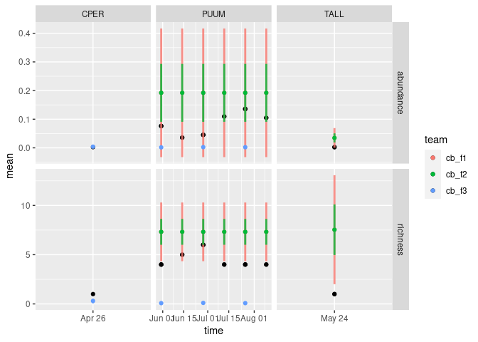

scores
================

``` r
library(tidyverse)
```

    ## ── Attaching packages ─────────────────────────────────────── tidyverse 1.3.1 ──

    ## ✓ ggplot2 3.3.5     ✓ purrr   0.3.4
    ## ✓ tibble  3.1.5     ✓ dplyr   1.0.7
    ## ✓ tidyr   1.1.4     ✓ stringr 1.4.0
    ## ✓ readr   2.0.2     ✓ forcats 0.5.1

    ## ── Conflicts ────────────────────────────────────────── tidyverse_conflicts() ──
    ## x dplyr::filter() masks stats::filter()
    ## x dplyr::lag()    masks stats::lag()

``` r
library(neon4cast)
```

``` r
targets <-
  "https://data.ecoforecast.org/targets/beetles/beetles-targets.csv.gz" %>% 
  read_csv(col_types = "cDdd")

targets <- read_csv("/minio/shared-data/beetles-targets.csv.gz", col_types = "cDdd")
```

``` r
## Not many new observations since 2021-05-01! 
targets  %>% 
  filter(time > as.Date("2021-05-01")) %>% as_tibble() %>%
  mutate(has_richness = !is.na(richness), has_abund = !is.na(abundance)) %>% 
  count(has_abund, has_richness)
```

    ## # A tibble: 1 × 3
    ##   has_abund has_richness     n
    ##   <lgl>     <lgl>        <int>
    ## 1 TRUE      TRUE             8

Convert the target data to long form (`time`, `siteID`, `target`, `obs`)

``` r
target_variables <- c("abundance", "richness")

tidy_targets <- targets %>% 
  pivot_longer(any_of(target_variables),
               names_to = "target",
               values_to = "obs")
```

Read in all the forecasts to a combined data.frame, using `id` column
from the filename. Parse filename into `theme`, `issue_date`, and
`team`.

``` r
pattern<- "(\\w+)\\-(\\d{4}\\-\\d{2}\\-\\d{2})\\-(\\w+)\\.csv\\.gz"

forecast <- 
  fs::dir_ls(glob = "beetles*.csv.gz") %>% 
  map_dfr(read_csv,
          show_col_types = FALSE,
          .id = "file") %>% 
  mutate(theme = gsub(pattern, "\\1", file),
         issue_date = gsub(pattern, "\\2", file),
         team = gsub(pattern, "\\3", file))
```

Convert forecast into tidy (long) form

``` r
## assumes mean-sd form, not appropriate for ensembles
tidy_forecast <- forecast  %>%
  pivot_longer(tidyselect::any_of(target_variables), 
               names_to = "target", values_to = "value") %>%
  pivot_wider(values_from=value, names_from = statistic)
```

To score a forecast, we can simply join the tidy tables and compute the
scores. We may first omit any predictions (target, siteID, time) points
where we lack an observation.

``` r
scored_forecast <- 
  left_join(tidy_forecast, tidy_targets) %>%
  filter(!is.na(obs)) %>% 
  mutate(crps = scoringRules::crps_norm(y = obs, mean = mean, sd = sd),
         logs = scoringRules::logs_norm(y = obs, mean = mean, sd = sd))
```

    ## Joining, by = c("time", "siteID", "target")

For bookkeeping, we compute the `forecast_start_time` as being one
observation interval before the first forecasted value in each site for
each target. (Because data collection lags behind or is missing in some
sites, their forecast start time may be considerably earlier than sites
which have more recent available data, even when the forecast for each
site is computed at the same time.)

Once we know the starting time, we can compute the horizon over which
any prediction was made.

``` r
interval <- tidy_forecast %>%
  group_by(theme, team, issue_date, target, siteID) %>% 
  summarise(interval = min(time-lag(time), na.rm=TRUE),
            forecast_start_time = min(time) - interval,
            .groups = "drop")


## add columns for start_time and horizon
scored_forecast <- scored_forecast %>% 
  left_join(interval) %>% 
  mutate(horizon = time - forecast_start_time)
```

    ## Joining, by = c("siteID", "theme", "issue_date", "team", "target")

``` r
scored_forecast %>% count(horizon, sort=TRUE)
```

    ## # A tibble: 12 × 2
    ##    horizon      n
    ##    <drtn>   <int>
    ##  1  28 days     8
    ##  2  42 days     8
    ##  3  56 days     6
    ##  4  14 days     4
    ##  5  70 days     4
    ##  6  84 days     4
    ##  7  98 days     4
    ##  8 112 days     4
    ##  9 364 days     4
    ## 10  63 days     2
    ## 11  91 days     2
    ## 12 119 days     2

``` r
df <- scored_forecast %>%
  group_by(theme, team, time, siteID) %>%
  slice_min(issue_date) %>%
#  slice_min(horizon) %>% 
  na.omit() #%>% 
#  filter(siteID %in% top_sites) 
  
df %>%
  ggplot(aes(x=time, y = mean, ymin = mean-2*sd, ymax = mean+2*sd, fill=team, col=team)) +
  geom_point(aes(y = obs), col="black") + 
#  geom_ribbon(alpha = 0.2, show.legend=FALSE) +
  geom_linerange(show.legend=FALSE, lwd = 1, alpha=0.8) +
  geom_point() + 
  # geom_line(aes(y = mean)) +
  facet_grid(target~siteID, scales = "free")
```

<!-- -->
